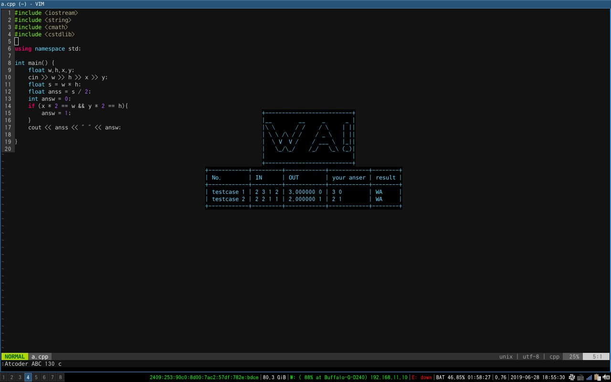
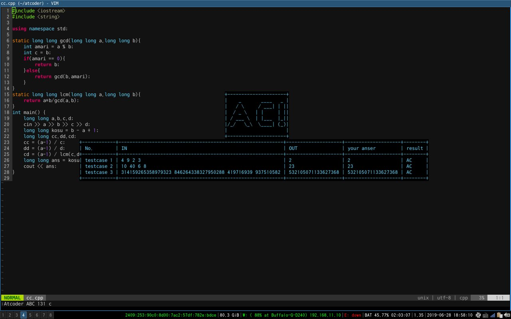

# vim-atcoder

atcoderのテストケースを自動で通すプラグインです。<br>
ポップアップウインドウを使っているためvimのバージョン8.1.1561が必須です。

### 機能
atcoderのテストケースのチェック



### 必須
* curl
* gcc
* vim 8.1.1561

### インストール
#### NeoBundle

```
NeoBundle 'cannot-fly-pig/vim-atcoder'
```

#### Vundle

```
Plugin 'cannot-fly-pig/vim-atcoder'
```
### 使い方
```
:Atcoder [ABC||AGC||ARC] [コンテスト番号] [task(aとかbとか)]
```
### 設定項目
```
let g:atcoder_login = 0 (デフォルトは0)
```
1にすることでログインができる(レートがつくコンテストはログインしないと問題が見れない
)
```
let g:atcoder_name = [ユーザー名]
let g:atcoder_pass = [パスワード]
```
ログインに必要
### 注意点

* 今の所 c++ (g++ -std=gnu++03 -O2 -I/opt/boost/gcc/include -L/opt/boost/gcc/lib -o ./a.out)にしか対応していません
* 企業コンには未対応です(対応予定)
